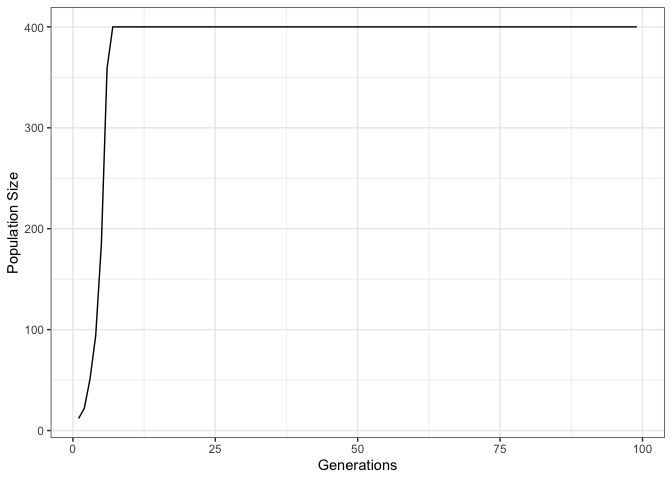
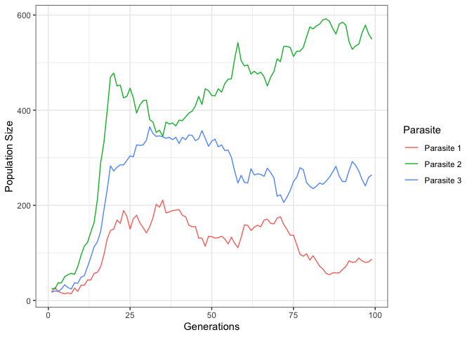

Simulating host parasite dynamics
================
Max R Brown
17 December, 2019

I am completely new to modelling host-parasite dynamics. I just thought
it would be interesting to do, as I have been investigating this with
emprical data. The object here was to simulate an interaction between a
host and a parasite, to look at dynamics primarily from the point of
view of the parasite. The object was also to sort of ‘tailor’ this for
plants. Plant parasites are interesting because they cannot move;
perhaps that makes the dynamics easier to code\! I am frightfully bad at
this, and I am really interested in taking this somewhere. I will
annotate the code as fully as I can and hopefully someone, somewhere can
help make these models (1) work properly, (2) under a variety of
scenarios and (3) make them more efficient\! They are pretty slow.

The models described are stochastic in nature, due to the way the
sampling from generation to generation works, rather than deterministic,
where equations are being solved.

## Installation

You can install this package by using the following commands:

``` r
# install.packages(devtools)
# devtools::install_github("Euphrasiologist/host_parasite_simulations")
library(HoPaSim)
```

## Rationale

These functions are designed to model a simple host parasite interaction
with a number of assumptions. A host grid is generated, which is fixed
for all future generations (i.e. they are perennial hosts). A parasite
grid is then overlaid, which contains ephemeral annual plant parasites
which persist only for a single generation. Depending on the benefit a
host gifts the parasite, this will determine the number of progeny
seeded in the next generation. Explicitly, the assumptions are:

  - that hosts are fixed in position and perennial, and are unaffected
    by parasitism. This is probably not totally realistic, because in
    reality, plant parasites have the capability of being really quite
    virulent.
  - no effect on parasite of nearby hosts. There is no additional
    weighted matrix which accounts for the spatial effects of
    parasitism. In reality, we know that plant parasites can attach to
    multiple hosts at the same time. Maybe for a future implementation.
  - parasites seed randomly over the field. Seed disperal in parasitic
    plants vary. Some are dispersed by ants, others mechanically or by
    wind.
  - all parasites survive to end of generation if they land on a host,
    and selection is \> 0. In the wild, parasites may well die due to
    environmental conditions or pathologies of host defence etc.
  - parasites do not produce any offspring without a host, and all
    parasites with a host reproduce. This is related to the previous
    point, however, it is known for some species (especially facultative
    parasites) that seed can be produced even without a host plant
    species.

Given these (not unreasonable) assumptions we can create a model which
can simulate parasite population sizes over time measured in
generations. These can be for single host parasite systems, single
parasite and multiple hosts, or multiple parasite species and multiple
host species.

### Single host single parasite system

This is the most simple system to model. In the functions, the user can
determine the size of the field to play on, the selective advantage
measured in terms of offspring that survive to maturity in the next
generation if you land on the host, number of host individuals and
number of parasites. Number of generations can also be specified.

In each run, there are three slots. The first describes the reproductive
output of each parasite species on each host, the second the parasite
reproductive output only across all hosts and lastly the realised
population size of each parasite species.

``` r
library(data.table); library(ggplot2)

sim1 <- manyhost_manyparasite(field.size = 25^2, interaction.matrix = matrix(3, 1, 1, dimnames = list("Host 1", "Parasite 1")), host.number = 400, parasite.number = 20, gens = 100)

# third slot is the population sizes of the parasite
sim1.2 <- setDT(sim1[[3]])

head(sim1.2)
#>      Parasite Generation Population Size
#> 1: Parasite 1          1              12
#> 2: Parasite 1          2              22
#> 3: Parasite 1          3              51
#> 4: Parasite 1          4              94
#> 5: Parasite 1          5             185
#> 6: Parasite 1          6             359
```

A plot can then be generated using the
data.

``` r
ggplot(sim1.2, aes(x = Generation, y = `Population Size`))+geom_line() + theme_bw() + xlab(label = "Generations") + ylab(label = "Population Size")
```

<!-- -->

For these parameters under this model, the parasite sweeps rapidly to
parasitise every possible host in about 20 generations. It is capped at
the upper limit of 400 as this is the number of host plants I seeded the
field with.

### Multiple host single parasite system

Adding another layer of complexity we can simulate a single parasite on
multiple hosts. The parameters are much the same as above, except this
time we add a matrix of selection coefficients for each of the host
species. Rather than making a separate function for this scenario, I
have been modifying the `manyhost_manyparasite()` function to allow for
a single parasite and multiple host species.

``` r
# set up interaction matrix

int.mat <- matrix(c(1,2,3), 3, 1, dimnames = list(c("Host 1", "Host 2", "Host 3"), c("Parasite 1")))

sim3 <- manyhost_manyparasite(field.size = 25^2, interaction.matrix = int.mat, host.number = c(200,200, 200) , parasite.number = 10, gens = 100)

ggplot(sim3[[1]], aes(x = as.numeric(Generation), y = Seed, group = `Host-Parasite`))+ geom_line(aes(colour = `Host-Parasite`)) + theme_bw() + xlab(label = "Generations") + ylab(label = "Seed output")
```

<!-- -->

In this example, the vector of selection coefficients is different for
each parasite on a different host. Because the hosts fill the grid
almost entirely, these selection coefficients act very efficiently
leading to a steady state equilibrium within only a few generations.
Other interesting dynamics can be explored by adjusting the parameters.

### Multiple parasite, single host system

Sometimes there will be multiple different parasite species in nature
that are parasitising the same host. We can also model
this.

``` r
int.mat <- matrix(c(10,9,9), 1, 3, dimnames = list(c("Host 1"), c("Parasite 1", "Parasite 2", "Parasite 3")))

sim4 <- manyhost_manyparasite(field.size = 40^2, interaction.matrix = int.mat, host.number = c(1000), parasite.number = c(200,200,200), gens = 100)

ggplot(sim4$Pop.Size.Para, aes(x = as.numeric(Generation), y = `Population Size`, group = `Parasite`))+ geom_line(aes(colour = `Parasite`)) + theme_bw() + xlab(label = "Generations") + ylab(label = "Population Size")
#> Warning: Removed 80 rows containing missing values (geom_path).
```

<!-- -->

In this simulation, we see that relatively minor differences in fitness
of different parasites on the same host will lead to one parasite
sweeping to fixation.

### Multiple parasites, multiple hosts

This is the most complex
scenario.

``` r
int.mat <- matrix(c(10,2,2,2,10,2,2,2,10), 3, 3, dimnames = list(c("Host 1", "Host 2", "Host 3"), c("Parasite 1", "Parasite 2", "Parasite 3")))

int.mat
#>        Parasite 1 Parasite 2 Parasite 3
#> Host 1         10          2          2
#> Host 2          2         10          2
#> Host 3          2          2         10

sim5 <- manyhost_manyparasite(field.size = 60^2, interaction.matrix = int.mat, host.number = c(300,300,300), parasite.number = c(100,100,100), gens = 100)

ggplot(sim5$Pop.Size.Para, aes(x = as.numeric(Generation), y = `Population Size`, group = `Parasite`))+ geom_line(aes(colour = `Parasite`)) + theme_bw() + xlab(label = "Generations") + ylab(label = "Population Size")
```

<!-- -->

Giving high specialism for each parasite, allows coexistence.
